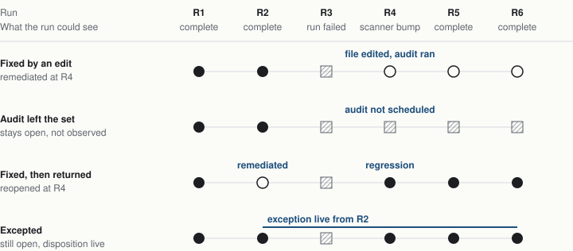

> **Strategic plan, 2026-09-28 (decisions and phases settled same day; Phase 1's core prerequisite confirmed merged same evening as tap#874 / PR#876).** How git-serious tracks a scanner's findings across repeated runs, resolves them when they are fixed, and excuses them on the record, starting with zizmor. Written by an AI support session at the maintainer's direction, from read-only research; claims are marked read, inferred or not observed. All eight decisions are settled, and the phase sequence follows the four goals agreed with the maintainer. Current state lives in the issues. Nothing here is canon — requirements live in specs.

# Findings over time

*A strategic plan for zizmor, and for the pattern underneath it*

*Prepared for George by the git-serious support thread · 28 September 2026, revised after [tap#874](https://github.com/unified-systems-com/tap/issues/874) · Nothing was built or changed to produce this*

> **How claims are marked.** *Read* means the file, issue or standard named was read during the research pass. *Inferred* means reasoned from what was read. *Not observed* means it would take a live instance to know, and none was queried. Nothing in this plan was executed.

## The short version

The last gap before git-serious can go fully public is that TAP cannot yet say a finding has ended, or been excused, in a way a stranger could audit. Today the zizmor findings table shows every finding the scanner has ever reported, and nothing removes one.[^1]

The recommendation is to treat this as one capability, not a zizmor feature. It has three layers. **Observations** record what the scanner saw in each run. **State** is what we conclude from those observations: open, remediated, or not observed. **Disposition** is what a person decided about a finding, such as accepting it or calling it a false positive. zizmor is the first tenant. A second scanner would use the same layers.

Much of the machinery already exists. github_core's reconcile pipeline has a completeness statement, candidate derivation, verdicts, a fence against stale verdicts and an operator switch. Three things are specific to this job. zizmor has none of the adoption pieces. A scanner’s “absent” means something different from a repository’s “absent”. And no exception model that anything uses today was found.

The prior-art sweep produced nine guarantees we could state publicly. They are in the fourth section, each with the proof it would need. The plan has four phase goals, agreed with the maintainer, plus a decide step and a public gate, and all eight decisions are now settled. Two ideas are parked with no phase: identity from paths and flows, and model-assisted comparison. The decisions come first in priority and last on the page.

## Where we are today

### zizmor records observations, and stops there

A finding’s id is derived from the workflow, the audit that fired, the symbolic route to the flagged spot in the YAML, and the persona.[^2] A second run over unchanged content finds the same node, moves its `observed_at`, keeps `known_since`, and adds an edge from the new run. That part works.

Five things do not work yet.

- **Nothing ends a finding.** The collector only adds. [tap#684](https://github.com/unified-systems-com/tap/issues/684) already frames the fix: a remediated finding is a state change with a reason, not a tombstone. A tombstone is the grid’s terminal mark for “this thing is no longer observed”.
- **A finding does not know which file content it judged.** Edit a workflow and the old finding stands as if it still applied ([zizmor-tap#37](https://github.com/unified-systems-com/zizmor-tap/issues/37), open).
- **The key uses a route, and routes move.** Insert a step above a flagged one and `steps/2` becomes `steps/3`. That would read as one finding resolved and a new one opened.[^3]
- **The `ignored` flag is stored and never used.** zizmor sets it when a workflow carries an inline `# zizmor: ignore[...]` comment. We save it under a tag named `ignored_by_config`, which is the wrong name, and only the detail panel reads it. Ignored findings count in run totals and appear in the table like any other.
- **A scanner upgrade can change a finding’s id with no file change.** zizmor 1.29 split `unpinned-uses` into two audits. Releases arrive every two to three weeks.

One asset is already in place. Each run records the scanner version, the persona, the audits it scheduled and the audits it skipped, all parsed from the binary’s own output. That is the raw material for saying what a run could and could not have seen.

### github_core already answers a nearby question

The reconcile pipeline in `tap_grid/specs/spec-grid-reconcile.md` works in stages. A run records what it saw and a completeness statement of six attributes. The system derives candidates for absence, meaning children in the grid minus what this run observed minus what is out of scope. A per-type *falsifier* probes each candidate and returns one of five verdicts. A fence rejects verdicts older than a newer observation. An operator arms the whole thing per collector, and it ships off.[^4]

It answers “does this thing still exist?” for repositories, workflows, jobs and environments. A scanner finding raises a different question: *did a scan that could have seen this finding fail to see it?* A falsifier compares stable source identity and owner. That does not carry over. What carries over is the run’s completeness statement and the pipeline shape. What is missing is a verdict that records remediation as a state change, and a way to compare what two runs could see.

[zizmor-tap#42](https://github.com/unified-systems-com/zizmor-tap/issues/42) already sketches the missing parts. It calls a parent scope node the central blocker: a zizmor-owned node meaning “this scanner’s claims about this workflow file under this persona”, which would survive between runs. It also sketches a per-audit reach comparison, which the resolution rules below adopt.

Tombstones are terminal, and a write to one fails the batch. Core’s natural-key requirement also says ids should be assigned and never derived, which zizmor’s uuid5 ids are. If zizmor ever tombstoned a finding under its current ids and the same defect returned, later batches would fail with `entity_tombstoned`.[^5] So a remediated finding must never be tombstoned, and the identity question has to be settled early.

**Where the conversion stands, updated 2026-09-28 evening.** The core prerequisite has landed. A `NATURAL_KEY` entry can now name a dotted path into a JSON field (`tap#874`, merged as [PR#876](https://github.com/unified-systems-com/tap/pull/876), `req-grid-entity-natural-key-14` through `-18`, all Implemented on `origin/main`) — declared explicitly with `zizmor__finding` named as its first consumer. The type system, typed equality, the absent/null/empty mapping, the guard, and the expression index are all built; nothing here is left for core to do. That merge also closed the lock-versus-search mismatch flagged below: `identity_lock_key` now treats only `None` as a hole, matching `find_existing` since `tap#867`. zizmor is still on the legacy path itself: it declares no `NATURAL_KEY` and supplies derived ids as `entity_id`, never as a `ref`. What remains is zizmor’s own work — declare the key over `location.full_name`, `location.workflow_id` and `location.route`, emit an absent `subfeature` as an empty string rather than `None` (`None` is still the one hole the search and the lock both refuse), switch the collector to refs, and discard existing findings, with no backfill, since the only instance running it today is a rebuildable dev stack.

### Exceptions: parts, but no working whole

The brief was for the exception capability to sit on the existing exception tracking. The search found four pieces, none joined to findings over time.

- **`compliance_exception`** in compliance_core has a source, a source key, a name, a description and a status of active, expired or revoked. Expiry, approver and review cadence are explicitly deferred. Nothing produces or consumes one anywhere in the repos searched.
- **github_core’s alert fold** maps both dismissed and fixed alerts to `resolved` and keeps the reason and the person on a detail node. It is the nearest working example of a finding over time.
- **`fips_waivers`** in boot records is the strongest process precedent. The operator selects them, never a plugin. A blank reason is a hard error. Waived items stay recorded and visible. It has no expiry and matches by path and provider, not per finding.
- **Break-glass merge exceptions** in `spec-cicd-review-readiness.md`, and the [tap#730](https://github.com/unified-systems-com/tap/issues/730) rule that exemptions are defined, never claimed by assertion.

If one of these was meant specifically, or something the search did not find, that changes the exceptions phase. Decision 2 asks.

### Places where the docs and code disagree

These are cheap to fix and expensive to build on. The reconcile requirement for observation lifetime is still Proposed while the verb applies tombstones with a closed reason vocabulary. A github_core test file contradicts itself about whether the reconcile verb is in the pinned core. The zizmor spec describes deterministic ids as the design, and core’s natural-key direction supersedes that without the spec recording the exception. The zizmor spec also says scanner versions are separate partitions, and the code says otherwise.

## What other systems of record do

Research passes read the documentation for scanners, triage platforms and standards. Where a page failed to load, the finding rests on a search summary or memory, and the sources section says which.

**How established systems match findings across runs, retire them, and excuse them**

| System | Matches a finding across runs by | When a finding vanishes | Exceptions |
| --- | --- | --- | --- |
| GitHub code scanning | Fingerprint of the flagged line, plus rule id. A changed file path makes a new alert. | Alert closes as fixed and reopens if the finding returns. | Dismissal with a fixed reason and a comment. Delegated dismissal adds an approver. |
| SonarQube | Three tiers: rule plus line hash, then rule plus line plus message, then moved-block detection. | Marked Fixed automatically, purged after 30 days, restored if it returns. Rule or analyzer changes are backdated so they do not look new. | Accepted or False Positive by an authorized user, and anyone authorized can reopen. No expiry was confirmed. |
| Semgrep | A match-based id that survives code moving inside a file. | Fixed if the code changed. Removed if the rule was disabled or the file deleted, and Removed stays out of the fix rate. | Ignore with a reason from a short list. Auto-triage yields “provisionally ignored” until a person confirms. |
| DefectDojo | The tool’s own id, or a hash of chosen fields, configurable per parser. | Reimport closes findings missing from the new report, scoped to the same test and service. Reappearance reactivates them. | Risk accepted, false positive and out of scope are protected from reactivation. |
| Dependency-Track | Component plus vulnerability. | Suppression carries over when the component returns. | false_positive, not_affected, resolved. Every change lands in a permanent audit history. |
| Trivy, Snyk, OSV | Vulnerability id, optionally with paths. | Stateless per scan. | Ignore files with a reason and an optional expiry. When present, expiry is enforced and the finding returns. |
| Kyverno | Not applicable. | Not applicable. | PolicyException with no lifetime. Expiry is a bolted-on cleanup policy. |

### Eight things nearly everyone does

1. Identity comes from the rule plus normalized content, never from a line number alone. Systems stack fallbacks, as Sonar does.
2. The scanner’s own stable id is preferred, and a hash is the fallback.
3. Disappearance is an inference, and its cause is recorded. Semgrep separates Fixed from Removed for exactly this reason.
4. Auto-closed findings reopen when they return.
5. Human decisions live in a separate, durable layer that re-scans do not overwrite.
6. Exceptions carry a reason, and the best carry an enforced expiry.
7. Suppression has an explicit scope.
8. A closed vocabulary exists for “not a real problem”. OpenVEX defines four statuses and five justifications.

### Where the field is weak, and TAP can be better

- **Nobody proves the scan was complete before closing a finding.** DefectDojo limits the damage by scoping closure to the same test. No system found checks coverage first. TAP already records completeness.
- **Reason, expiry and approver are optional almost everywhere.** A field that nothing enforces is decoration. Trivy’s `statement` is metadata only.[^6]
- **Nobody reports an exception that no longer matches anything.** No external tool found does. TAP’s own guards already do it for code: `DirectWriteExemptionGuard` fails a `# TAP-WRITE-COV` annotation the moment it stops suppressing a flagged write.[^7]
- **Inline suppression is in the author’s hands.** A pull-request author can add the comment that silences their own finding. SARIF names the split as `inSource` versus `external`. For a public product the author is untrusted by definition.
- **Scanner drift is a confound.** Sonar backdates issues after analyzer upgrades. Most systems do not.

### What the standards add

**SARIF 2.1.0** gives a vocabulary for exactly this problem. A result’s `baselineState` is `new`, `unchanged`, `updated` or `absent`, and the spec is careful to call `absent` a fact about two runs. A system may respond by resolving the issue, and that is the system’s policy. Fingerprints carry a version, and a matcher compares on the highest version both results share. A suppression has a `kind` (`inSource` or `external`) and a `status` (`accepted`, `underReview`, `rejected`). A null suppression list means “not evaluated” and an empty one means “evaluated, none”.

**OpenVEX and CSAF** require a justification from a closed list before a finding can be called not affected, and they attach a timestamp to every statement. A newer statement supersedes an older one. Nothing is deleted.

**FedRAMP’s 2026 vulnerability rules** require a record for each accepted vulnerability: an internal tracking id, when and by what source it was detected, when evaluation finished, whether it is internet-reachable and likely exploitable, its PAIN rating, and an explanation. They also require reports to summarize all activity since the previous report. This is close to the exception record proposed below, which matters if git-serious ever needs to speak to a compliance audience.[^8]

**The research literature** agrees with the platforms. Semmle’s paper matches by diffing locations first, then by hashing surrounding tokens for what is left, on the grounds that neither method wins alone. Martin Fowler’s bitemporal writing supplies the frame for corrections: keep what was true and what we knew as separate timelines, and never rewrite an old observation.

## The model: three layers, and the rules between them

**Each layer has one author and one rule about changing**

| Layer | What it says | Written by | May it change? |
| --- | --- | --- | --- |
| Observation | In run R, scanner S at version V, covering these audits and these workflows, reported this finding. | The collector, once per run. | Never. Append only. |
| State | The finding is open, remediated or not observed, with the reason, the concluding run and the evidence. | A verb that reads observations and the run’s coverage. Never a person, never the collector. | Yes, but each change is recorded and the earlier state stays in history. |
| Disposition | A named person decided this finding is a false positive, an accepted risk, or mitigated elsewhere, for this reason, until this date. | A person or approved process, through a reviewed path. | By supersession. A new record replaces an old one and the old one stays. |

Keeping these apart is the one design move every mature system makes. A re-scan must never overwrite a human decision, and a human decision must never edit what the scanner saw. It also explains why the alert fold in github_core works: the finding’s status stays plain and the truth lives one edge away.

### Nodes and edges

Names follow the add-edge skill: an action verb plus an object noun, the initiator as the source, no bare verbs, and each slug carries the owning plugin’s suffix, as the existing edges do (`PRODUCED_FINDING__zizmor`). These are working names, to be confirmed in Phase 1 before any edge file is written. The lifecycle needs two new node kinds, new fields on the finding and the run, and six new edges. The rest exists already. Occurrence and position stay on the node, because the skill says a step or an occurrence that needs its own identity is a node and never part of an edge id.

**The grid vocabulary this plan needs**

| Kind | Name | Status | What it carries or connects |
| --- | --- | --- | --- |
| Node | `zizmor__finding` | Exists | Gains the scanned content hash, a state, and a state reason. |
| Node | `zizmor__run` | Exists | Gains the completeness statement. |
| Node | scope | New ([zizmor-tap#42](https://github.com/unified-systems-com/zizmor-tap/issues/42)) | “This scanner’s claims about this workflow under this persona.” It survives between runs. |
| Node | exception | New, or extends `compliance_exception` | The record above, including the reference source code cites. |
| Edge | `PRODUCED_FINDING`, `SCANNED_WORKFLOW` | Exist | Run to finding, and run to workflow with an outcome and a reason. |
| Edge | `FLAGS_WORKFLOW`, `FLAGS_JOB`, `FLAGS_ACTION` | Exist | Finding to what it flags. |
| Edge | `ASSERTS_FINDING` | New | Scope to finding. The scope’s claim set, one scope per workflow and persona. |
| Edge | `AUDITS_WORKFLOW` | New | Scope to workflow. What the scope’s claims are about. |
| Edge | `CHANGES_FINDING_STATE` | New | Run to finding. The run that moved the finding’s state, as evidence. Its properties (from state, to state, reason) need a property schema. |
| Edge | `COVERS_FINDING` | New for zizmor | Exception to finding. compliance_core already has `COVERS_COMPLIANCE_FINDING` for its own finding type. Owner and endpoint list follow decision 2 and [tap#467](https://github.com/unified-systems-com/tap/issues/467). |
| Edge | `CITES_EXCEPTION` | New | Finding to exception, created only when a citation in source resolves to a live node. |
| Edge | `SUPERSEDES_EXCEPTION` | New | Exception to the exception it replaces. |

### Exporters are separate plugins

SARIF and OpenVEX export will be reused by every scanner, so each is its own plugin and not part of zizmor. A reusable exporter cannot depend on `zizmor__finding`. It has to read a neutral finding vocabulary, which makes the base-node question in [tap#467](https://github.com/unified-systems-com/tap/issues/467) a prerequisite for the exporters and more than a tidy-up. zizmor’s own obligation is small: its findings and exceptions must be expressible in that neutral vocabulary.

The two formats do not fit the same findings. SARIF describes results at locations and carries suppressions, so it fits workflow findings and their exceptions. OpenVEX states whether a product is affected by a vulnerability, with justifications such as *vulnerable code not present*, so it fits dependency and container vulnerabilities and not a CI misconfiguration.[^9] The exporter plugin names are still to be settled. So far the `*_core` suffix has marked neutral vocabulary plugins, and an exporter is a consumer of one.

### Identity

Keep the symbolic key as the first tier. Add a second tier from the flagged text itself, the audit id and a hash of the feature the audit pointed at, as Sonar uses a line hash. Record the scanned file’s content hash on every observation, which is the fix [zizmor-tap#37](https://github.com/unified-systems-com/zizmor-tap/issues/37) already asks for. Version the identity algorithm, as SARIF versions its fingerprints, so a later change to the key can be compared against older findings. If a step insertion moves the route, the second tier can still match it. The first job is to test how often the route moves on real workflows, before designing the fallback.

### The resolution rules

A finding may leave *open* for *remediated* only if a later run completed, evaluated that workflow, and ran that finding’s audit at a compatible scanner version and persona, and the file content changed since the finding was last seen. Everything else is one of the other rows.[^10]

**What a finding’s absence means, by what changed between the two runs**

| What changed | Finding is absent. Conclusion: |
| --- | --- |
| File edited, audit ran at a compatible scanner version and persona, run complete | Remediated. Record the concluding run, the new content hash and the audit that ran. |
| File identical, scanner version bumped | Not observed, labelled “no longer reported by the scanner”. This is the scanner changing its mind, and it is not a fix. |
| File identical, same scanner, still absent | An anomaly. A deterministic offline scan should not change its answer. Raise a flaw and conclude nothing. |
| Audit missing from the run’s scheduled set, or skipped | Not covered. The finding keeps its last state and is shown as not observed since that run. |
| Run failed, partial, or upstream collection was in flight | Nothing concluded. A failed run’s evidence licenses nothing. |
| Audit renamed or split by a scanner release | Not observed, until a reviewed lineage table for that release says which new audit inherits the old one. |
| Workflow deleted | The existing reconcile path: a real tombstone on the workflow, with the finding cascaded. |
| Finding present, severity or confidence differs | Updated. Same finding, new observation. Not a new finding. |
| Remediated finding appears again | Reopened as the same finding, flagged as a regression, with its first-seen date preserved. |

*Four findings over six runs. A filled circle is a run that reported the finding. An open circle is a run that covered the finding and did not report it. A hatched square is a run that could not have seen it, so nothing is concluded. Only the first row and the third end in a conclusion about a fix. R4 is a scanner bump. The first finding’s audit is unchanged across it, so its absence still counts. The second finding’s audit is not scheduled after it, so nothing is concluded.*

### What repeated runs are for

The stated goal is to use repeated runs to falsify or adjust findings. The evidence supports two uses and argues against a third.

- **Falsify.** A later covered run that does not report the finding is the evidence that ends it. The rule above says when a run counts.
- **Adjust.** A finding that persists with a different severity, confidence or audit lineage across scanner versions is an update to the same finding. Semgrep’s Fixed versus Removed split is the precedent.
- **Not a delay timer.** The reconcile spec deliberately has no time-based hysteresis, and says corroboration must be a different kind of observation, not a repeat after waiting. An offline scan of identical content is deterministic, so a second run adds nothing. What can go wrong is the collection feeding it, which is why the completeness statement, and not a run count, is the gate.[^11]

## Exceptions, built on what exists

Exceptions are their own nodes on the grid, and that is where they live. Source code can cite one, and checking that each citation resolves to a real, live node is part of the value. The record below is that node’s shape. Whether the node extends `compliance_exception` or is a new type is still open (decision 2). The process rules should copy `fips_waivers`: operator-selected, a blank reason is an error, and a waived item stays visible.

### The record

The minimum fields, taken from the exception-governance sweep and lined up with the FedRAMP accepted-vulnerability record:

- **Target.** The finding’s identity, the identity algorithm version, the audit id, the scanner lineage, and the content anchor. Never a line and column.
- **Disposition.** One of `false_positive`, `accepted_risk`, `mitigated_elsewhere`, `wont_fix`, `under_investigation`, with a justification code from a closed list and required free text.
- **People.** A requester and a decider, each with a timestamp. The rule that they must differ is enforced later.
- **Review-by date.** Required, with a system maximum. A missing date is a rejection, never “forever”.
- **Origin.** `external` for a reviewed record, `in_source` for a comment seen in the workflow.
- **Reference.** The identifier source code cites. It must be stable, short enough to sit in a comment, and resolve to exactly one node. The format is still to be settled.
- **Supersedes.** A pointer to the prior record.

### The lifecycle

`proposed` becomes `approved`, then `live`. From live it can go `stale`, `expired`, `revoked` or `superseded`. A proposal can also be `rejected`. An exception is *live* only while it is approved, unexpired, and its target was matched by the latest completed run. If it matches nothing, it is *stale*, and stale is reported, not silent. If any part of its target changes, including a scanner bump, a rule rename or a different fingerprint, it returns to `proposed`. This inverts Kyverno and Gatekeeper, which persist until someone deletes them.

### Anti-abuse rules for a public product

1. Requester is never the decider. The data model records both, and enforcement comes later. GitHub’s delegated dismissal is the nearest precedent, though the page reviewed did not confirm how it handles a requester approving their own request.
2. An exception counts only if it is a node on the grid. A comment in source is at most a citation of one, and a citation that resolves to no live node has no effect.
3. The store is gated where it is kept. A fork can propose a record. It cannot make one live.
4. There are no defaults that satisfy. Reason, decider and review-by are mandatory.
5. Any change to the target fails closed.
6. A malformed record is invalid, loudly. Snyk’s bad date meaning forever is the counter-example.
7. Stale exceptions are findings in their own right, and the count and age of exceptions are measured.
8. Suppressed is not deleted. The finding stays, with its disposition and history.
9. Scope is as narrow as the finding. No file-wide or repository-wide wildcards by default.
10. A run that did not happen never marks anything stale or resolved.

### Citing an exception from code

TAP’s local convention for an exception in code is a per-site marker with a written reason: `# TAP-WRITE-COV: <reason>` for a direct write, `# noqa: TAP-LOG-ID` for a log call. A guard fails a marker that no longer suppresses anything. The same pattern fits here with one change. The marker cites an exception node, and carries free text only as a supplement.

zizmor already accepts an inline `# zizmor: ignore[audit]` comment with optional trailing text, so the citation can ride in that text.[^12] A validator then checks each citation against the grid:

- A citation that resolves to a live exception node whose target matches the finding at that site is *backed*, and the finding links to the node.
- A citation that resolves to nothing, or to a node that is stale, expired, revoked or aimed at a different finding, is reported. The finding stays open and shows an unbacked claim.
- A `zizmor: ignore` comment with no citation is also an unbacked claim. zizmor sets its `ignored` flag either way, so that flag alone never excuses anything.
- An exception node with no citation in code is fine. It is an external exception and applies on its own.

A workflow author can write any comment, so a comment is never what excuses a finding. The node is, and the comment only points at it. Line-based config ignores break on the same edits the finding key is meant to survive, so The recommendation is not to honour them.

## The guarantees

These are the promises the sweep supports, worded so each can be tested. The right-hand column is the proof each would need before it is stated publicly.

**Nine guarantees**

| # | TAP guarantees that | It follows from | We would prove it by |
| --- | --- | --- | --- |
| 1 | A finding keeps its identity when code around it moves, and the identity algorithm is versioned. | SARIF result matching and versioned fingerprints. Sonar and Semgrep matching. Semmle’s two-stage method. | A fixture where a step is inserted above a finding and the finding keeps its id. |
| 2 | Observations are append-only. A later run never edits an earlier one. | Bitemporal history. OpenVEX supersession. CSAF revision history. | A test that a second run leaves every earlier observation unchanged. |
| 3 | Absent is not fixed. A finding leaves open only when a run that covered it did not see it. | SARIF `absent` as a fact about two runs. Sonar’s automatic Fixed, made safer by a coverage check. | The four scenarios in the figure, plus a failed run, against a fixture. |
| 4 | Every run states what it covered: scanner, version, persona, audits scheduled and skipped, workflows evaluated, and the input snapshot. | The in-toto vulnerability predicate. zizmor’s own inventory. The reconcile completeness statement. | A run that omits any of these is refused and cannot conclude anything. |
| 5 | A scanner or rule change is labelled as such. It is never counted as a fix or as a regression. | Semgrep’s Fixed versus Removed. Sonar’s backdating. | A fixture across a scanner bump with an audit split. |
| 6 | Unknown is never shown as clean. Open, remediated and not observed are three different displays. | SARIF null versus empty suppressions. The unbuilt three-state rendering in the reconcile spec. | Rendered pages checked for all three states. |
| 7 | Every exception has a coded reason, a requester, a decider and a review-by date, and it fails closed when its target changes. | OpenVEX and CSAF justification lists. FedRAMP accepted-vulnerability fields. GitHub delegated dismissal. | Tests that a missing reason is refused, a missing date is refused, and a scanner bump returns an exception to proposed. |
| 8 | Suppressed is never deleted. Stale exceptions are reported, and so is an in-code citation of an exception that does not exist or is no longer live. | SARIF suppressions. Dependency-Track’s permanent history. TAP’s own exemption guard. No external tool checks for stale exceptions. | A stale-exception report over a fixture with one live, one stale and one expired record, and a citation check over one that resolves, one that resolves to nothing and one that resolves to an expired node. |
| 9 | Findings and their exceptions export in a standard shape: SARIF with `baselineState` and suppressions, and OpenVEX where the finding is a vulnerability. Each exporter is its own plugin. | The interoperability convergence across the standards read. | An export that round-trips through a SARIF validator. |

**Deferred, not dropped.** The evaluation process is not yet robust enough to enforce that a requester cannot be the decider, that only a reviewed store makes an exception live, or that a fork cannot make one live. Those rules are layered in later. Until they are enforced, the published list leaves out any claim that depends on them, and guarantee 7 says only what the record shape and the fail-closed behaviour deliver.

**Passes.** TAP tags work `make-it-work`, `make-it-right` and `make-it-fast`, and this plan is scoped to the first. Decision 8 applies that framing to the guarantees specifically: they are the target list, not a set of hard blockers. If a guarantee turns out to need disproportionate effort against one of the four phase goals below, it moves to a later pass rather than stalling this one.

## The plan

The sequence below follows four phase goals, agreed 2026-09-28: a working re-run that does not duplicate findings, then exceptions as first-class grid citizens, then resolution across a changed file at one scanner version, then resolution across a scanner or rule change. Each phase depends on the one before it.

**Six phases**

| Phase | Goal | Work | Needs first | Already filed | Done when |
| --- | --- | --- | --- | --- | --- |
| 0. Decide | — | Record the eight decisions on one issue. | Review of this page. | None. | Done: all eight are settled above. |
| 1. Re-run without duplicating | A functioning implementation of zizmor that can re-run an assessment against an unchanged file and not duplicate findings, only update existing ones. | The core prerequisite (`tap#874`, natural keys over JSON sub-fields) is merged. Declare the finding’s natural key over the `location` JSON, emit an absent `subfeature` as an empty string, switch the collector to refs, and discard existing findings, with no backfill. Record the scanned content hash on each observation ([zizmor-tap#37](https://github.com/unified-systems-com/zizmor-tap/issues/37)), for phase 3 to use. Adopt the run’s completeness statement. Fix the skip guard so a stale RUNNING job cannot stall runs for days ([zizmor-tap#41](https://github.com/unified-systems-com/zizmor-tap/issues/41)). Correct the `ignored` tag. Test route stability on real workflows, since phase 3 depends on the answer. | Phase 0. Core prerequisite already merged. | [zizmor-tap#37](https://github.com/unified-systems-com/zizmor-tap/issues/37), [zizmor-tap#41](https://github.com/unified-systems-com/zizmor-tap/issues/41) | A re-run over byte-identical content updates existing finding rows (`observed_at` moves, `known_since` is preserved) and creates zero duplicate finding nodes. |
| 2. Exceptions on the grid | Support for exceptions as first-class citizens, operational on the grid. | Build the exception node, extending `compliance_exception`. Add an operator-only creation path modeled on `fips_waivers`. Record requester and decider as separate fields, with the two-person rule deferred. Add `COVERS_FINDING`, `CITES_EXCEPTION`, the in-code citation validator, and the stale detector and audit trail. | Phase 1, for a stable finding identity to attach to. | Compliance bridge requirement in the zizmor spec (Backlog) | An exception is a grid node that covers a finding. A citation in source resolves against a live node or is reported. A stale or expired exception is listed. |
| 3. Same scanner, changed file | Support for shifting files, same scanner. | Add the scope node ([zizmor-tap#42](https://github.com/unified-systems-com/zizmor-tap/issues/42)). Add `ASSERTS_FINDING`, `AUDITS_WORKFLOW`, `CHANGES_FINDING_STATE`. Build the `remediated` verdict for a covered, completed run against changed content at the same scanner version and persona. Add reopening and the three-state rendering. Arm reconcile on one instance first. Decide how to avoid the history churn from re-observing every finding every run ([tap#322](https://github.com/unified-systems-com/tap/issues/322)). | Phase 2. | [zizmor-tap#42](https://github.com/unified-systems-com/zizmor-tap/issues/42), [zizmor-tap#27](https://github.com/unified-systems-com/zizmor-tap/issues/27), [tap#684](https://github.com/unified-systems-com/tap/issues/684), [tap#322](https://github.com/unified-systems-com/tap/issues/322) | The first and third rows of the figure behave as drawn against a fixture: an edited-and-fixed file resolves, and a fix that later regresses reopens as the same finding. |
| 4. Scanner and rule shifts | Support for shifting rules inside a scanner, and scanner versions. | Build the per-audit reach comparison ([zizmor-tap#42](https://github.com/unified-systems-com/zizmor-tap/issues/42)). Add the reviewed audit-lineage table a scanner bump must clear before a resolution counts, and the scanner-version compatibility condition on the `remediated` verdict. Label a scanner or rule change as such, never as a fix or a regression. | Phase 3. | [zizmor-tap#42](https://github.com/unified-systems-com/zizmor-tap/issues/42) | The second row of the figure behaves as drawn: an audit that leaves the scheduled set stays open and not observed, never remediated. A scanner bump with no lineage entry concludes nothing. |
| 5. Public gate | — | Pin each guarantee still standing with a test. Confirm zizmor’s findings and exceptions are readable by the separate SARIF exporter plugin. The OpenVEX exporter serves vulnerability findings and is not zizmor’s to ship. Review the public threat model: untrusted authors, forks, repository-side config. Dry-run against real organizations. Publish the guarantees that are enforced by then. | Phases 3 and 4. | None yet. | Every guarantee still in scope has a passing test and the maintainer has reviewed the result. |

No dates are attached to these. Phase 1 is bounded by one core issue already filed. Phase 3 carries the most uncertainty even though it now precedes phase 4, because [zizmor-tap#42](https://github.com/unified-systems-com/zizmor-tap/issues/42) calls the underlying scope-node work harder than github_core’s adoption, not smaller.

## Parked ideas

Neither of these has a phase. The plan above is the mechanical work, and nothing in the guarantees depends on either idea.

### Backlog: identity from paths and flows

A workflow is a graph of jobs, steps, reusable workflows and composite actions, and zizmor’s route is already a path through it. Identifying findings by that structure, and for flow-shaped findings such as template injection by the path from source to sink, would give stronger remediation evidence than text at a line. It would need a lineage mechanism for renames.[^13] Guarantee 1 makes the identity algorithm versioned, so a structural tier can be added later without orphaning older findings.

### Backlog: shipping more than one scanner version

zizmor is one static binary, so the plugin could ship the previous version beside the current one. When a release changes or splits an audit, run both versions over the same file. If the old binary still reports a finding the new one does not, the scanner changed its mind. If neither reports it, the file was fixed. That separates the two rows in the resolution table that otherwise end in “not observed”. Run over a test corpus, the same two-version comparison would also produce the audit-lineage table for a release mechanically, from behaviour instead of release notes.[^14] It would need a rule for how many old versions to keep.

### Spitballing: a model to weigh in where mechanical comparison runs out

Where the resolution table ends in “not observed”, one or more models could read the two file versions and offer an opinion, and several vendors agreeing would be closer to consensus. Two constraints would carry over from the rest of the plan if this is ever picked up. A model’s opinion is recorded and never recomputed, and it may move a finding toward more caution but never toward silence, because the file it reads is attacker-controlled. Semgrep’s “provisionally ignored” and SARIF’s `underReview` status are the existing precedents for a machine proposal that a person confirms. That is as far as it has been taken.

## What could go wrong

- **Route instability may be worse than expected.** If it is, the second identity tier moves from a refinement to a requirement. That is why Phase 2 tests it first.
- **A `None` key part still duplicates findings.** The core fix makes `""` searchable, but `None` still short-circuits the search on both the read side and the lock. zizmor’s `subfeature` is `None` on most findings, so the collector must emit an empty string, not leave it `None`, or every re-run mints a duplicate.
- **The id question can break a tombstone-free design.** Derived ids plus a terminal tombstone plus a returning defect equals failed batches. Remediation must stay a state change.
- **History churn.** A finding re-observed every six hours adds a history row each pass. [tap#322](https://github.com/unified-systems-com/tap/issues/322) records roughly 232,000 history rows per day per instance for re-emitted nodes generally. Zizmor findings would add to that.
- **The skip guard trusts a stale RUNNING job forever** and logs each skipped run as successful. It cost four days of silent stalling in September. Anything counting on run cadence inherits that hazard.
- **The reconcile guards are unbuilt.** The bulk-absence circuit breaker and three-state rendering are Backlog. Arming reconcile before the breaker exists means a bad run could mark many things absent at once.
- **An audit lineage table is a maintenance burden.** If it lags a release, findings fall to “not observed”, which fails safe but shows a lot of noise after each upgrade.
- **No live instance was queried.** Whether reconcile is armed anywhere, and how many findings would change state on the first run, are not observed.

## Decisions

**Each decision, with the recommendation at the time of writing**

| # | Question | Recommendation |
| --- | --- | --- |
| 1 | Is observation, state, disposition the frame for this work, with zizmor as the first tenant? | Settled: yes. |
| 2 | Which is the “existing exception tracking”? The search found compliance_exception, fips_waivers and break-glass merges, and none has a consumer for findings. | Settled: exceptions are their own grid nodes, source code cites them, and the node extends `compliance_exception`. |
| 3 | Finding identity: keep the symbolic key, add a content tier, version it, and move to assigned ids with a natural key? | Settled: yes, with the natural key declared over the `location` JSON ([tap#874](https://github.com/unified-systems-com/tap/issues/874)) and existing findings discarded. The content tier is still sized by the Phase 2 route test. |
| 4 | Is remediation a state change and never a tombstone, as [tap#684](https://github.com/unified-systems-com/tap/issues/684) says? | Settled: yes. A tombstone stays for a deleted workflow only. |
| 5 | Is one covered absence enough, or should it take two runs? | Settled: one, gated on the completeness statement. A two-run rule applies only where completeness was not stated. |
| 6 | Repository-side ignores and config: show them, or honor them? | Settled: show them as unreviewed claims. Never apply them to a gate. |
| 7 | Where does each piece live? | Settled: the `remediated` verdict in the reconcile spec, the exception record in compliance_core, adoption in the zizmor spec. SARIF and OpenVEX export are their own plugins, not part of zizmor. Landed in the repo at `docs/doc-git-serious-findings-over-time.md` ([PR#128](https://github.com/unified-systems-com/git-serious-tap/pull/128)), which is now the master copy. |
| 8 | Are the nine guarantees the gate for going public, or only part of it? | Settled: they are the gate, but this is still a `make-it-work` pass. Any guarantee that proves excessively complex or costly may be relaxed and deferred to `make-it-right` or `make-it-fast`, rather than blocking the four phase goals below. |

## Sources and their limits

The standards and platform pages were read in full where a fetch succeeded. Fetches for the Snyk `.snyk` page, DefectDojo’s deduplication pages and Dependency-Track’s auditing page failed, so those rows lean on search summaries. The Trivy stale-entry behavior, NIST 800-53, ISO 27001, EPSS, SLSA and the CycloneDX schema were not read. No claim about a live TAP instance was checked.

[SARIF 2.1.0, sections 3.27 and 3.35](https://docs.oasis-open.org/sarif/sarif/v2.1.0/errata01/os/sarif-v2.1.0-errata01-os-complete.html) · [OpenVEX](https://github.com/openvex/spec/blob/main/OPENVEX-SPEC.md) · [CSAF 2.0](https://docs.oasis-open.org/csaf/csaf/v2.0/os/csaf-v2.0-os.html) · [FedRAMP VDR](https://www.fedramp.gov/2026/reference/vulnerability-detection-and-response/) · [FedRAMP VER](https://www.fedramp.gov/2026/reference/vulnerability-evaluation-and-reporting/) · [in-toto vulnerability predicate](https://github.com/in-toto/attestation/blob/main/spec/predicates/vuln.md) · [OSCAL POA&M](https://pages.nist.gov/OSCAL/learn/concepts/layer/assessment/poam/) · [Semmle, tracking violations](https://codeql.github.com/publications/tracking-analysis-violations.pdf) · [Fowler, bitemporal history](https://martinfowler.com/articles/bitemporal-history.html) · [Sonar analysis process](https://docs.sonarsource.com/sonarqube-server/discovering/analysis-overview/process-steps) · [GitHub SARIF support](https://docs.github.com/en/code-security/code-scanning/integrating-with-code-scanning/sarif-support-for-code-scanning) · [GitHub alert resolution](https://docs.github.com/en/code-security/code-scanning/managing-code-scanning-alerts/resolving-code-scanning-alerts) · [Semgrep triage](https://docs.semgrep.dev/semgrep-code/triage-remediation) · [DefectDojo reimport](https://docs.defectdojo.com/import_data/import_intro/reimport/) · [Dependency-Track suppression](https://docs.dependencytrack.org/triage/suppression/) · [Trivy filtering](https://trivy.dev/latest/docs/configuration/filtering/) · [Kyverno exceptions](https://kyverno.io/docs/exceptions/) · [zizmor usage](https://docs.zizmor.sh/usage/) · [zizmor configuration](https://docs.zizmor.sh/configuration/)

*Internal sources: zizmor-tap specs and issues [zizmor-tap#27](https://github.com/unified-systems-com/zizmor-tap/issues/27), [zizmor-tap#37](https://github.com/unified-systems-com/zizmor-tap/issues/37), [zizmor-tap#41](https://github.com/unified-systems-com/zizmor-tap/issues/41), [zizmor-tap#42](https://github.com/unified-systems-com/zizmor-tap/issues/42); tap issues [tap#140](https://github.com/unified-systems-com/tap/issues/140), [tap#322](https://github.com/unified-systems-com/tap/issues/322), [tap#684](https://github.com/unified-systems-com/tap/issues/684); `tap_grid/specs/spec-grid-reconcile.md`; compliance_core’s `compliance_exception`; `tap/crypto_bom.py` waivers.*

[^1]: Read: [zizmor-tap#27](https://github.com/unified-systems-com/zizmor-tap/issues/27) (open) and the Known Gap note in the zizmor spec. A fixed finding simply stops being emitted. Its node stays as it was.
[^2]: Read: `identity.py` and `collector.py:284-326` in zizmor-tap. The route looks like `jobs/build/steps/2/uses`. Persona is part of the key because the run uses the `auditor` persona, which reports things the default persona hides.
[^3]: Inferred from the route structure. Not tested. It should be tested against real workflows before anything rests on it.
[^4]: Read: `spec-grid-reconcile.md`, `tap_grid/completeness.py`, `candidates.py`, `falsifiers.py`. Whether reconcile is armed on any live instance: not observed.
[^5]: Inferred from `spec-grid-entity.md:882-900` and `identity.py`. The consequence has not been demonstrated.
[^6]: Read: Trivy filtering docs. Snyk’s `expires` with a badly formatted date persists forever, per the governance pass’s reading of Snyk’s docs.
[^7]: Read: the tap repository’s AGENTS.md and [tap#730](https://github.com/unified-systems-com/tap/issues/730). The claim about external tools is an inference from absence, in a search that was not exhaustive.
[^8]: Read: fedramp.gov/2026 VDR and VER pages. NIST 800-53, ISO 27001, SLSA and Scorecard were not read, so nothing here cites them.
[^9]: Inferred from the shape of the OpenVEX spec, which the research pass read: statements about a vulnerability and the products it may affect. Not tested against a zizmor finding.
[^10]: The file-changed condition and the scanner-moved case come from [zizmor-tap#42](https://github.com/unified-systems-com/zizmor-tap/issues/42). The rest is the completeness discipline from the reconcile spec and the SARIF note that the producer must not leave results undetermined.
[^11]: Read: reconcile spec line 337. Decision 5 asks whether a two-run rule is wanted anyway for cases where github_core did not state completeness.
[^12]: Read: zizmor usage docs, through the research pass. The plugin already receives the workflow YAML, so it can read the comment itself. The plugin cannot see zizmor’s config file, because the scratch tree holds only workflow files, and the recommendation is to keep it that way.
[^13]: Inferred. Source indexers such as Kythe and SCIP, and SARIF’s `logicalLocations`, address structural names, but they were cited from memory and neither was fetched.
[^14]: Read: `binary.py` locates one binary and checks it against a single `zizmor==` pin in the distribution metadata, so that assumption would change. Inferred: the boot record’s FIPS waiver is scoped by artifact path, and whether its glob covers a second binary was not checked. Each shipped binary would also be declared under the capability manifest ([tap#859](https://github.com/unified-systems-com/tap/issues/859)).
